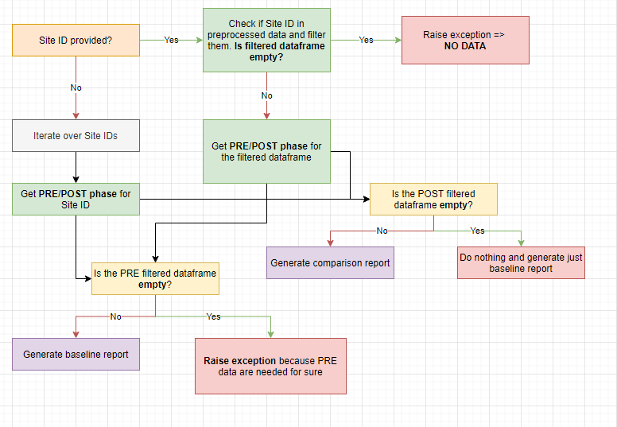

= RES-Q db package
Marie Jankujova <jankujova.marie@fnusa.cz>
:doctype: article
:toc: true
:toclevels: 1
:imagesdr: assets/images
:source-highlighter: rouge
:rouge-style: Colorful
:revnumber: 1.0
:revdate: June 1, 2020
:revmark: {doctitle}
:description: RES-Q db package 
:keywords: RES-Q db
:icons: font
:setlinks: 
//:pdf-them

== Add calculation for PT values
In our calculation we are missing calculation for variables added this year. We are missing `PRENOTIFICATION` and `MRS_PRIOR` variables.

At first, these two columns has to be kept in preprocessed data. Because these columns ends with `PT_2` and not with `EN`, they are excluded from the preprocessed data in preprocessing. Open `Connection.py` and add the following lines in the `prepare_df()` function. 

.Connection.py
[source,python]
----
df.rename(columns={
    'prenotification_pt_2': 'prenotification_en',
    'mrs_prior_stroke_pt_2': 'mrs_prior_stroke_en'
}, inplace=True)
----

Now, we can add calculation into `Calculation.py`. Two code will be added. One for prenotifiaction with options Yes, No and Unknown. And second is mRS prior to stroke, where we have values 0-6 and unknown. The cases with unknown are excluded from the calculation and median has been calculated. Also, we 

.Calculation.py
[source,python]
----
# tag::prenotification[]
####################
# PRE-NOTIFICATION #
####################
pt_3_form_version = self.df.loc[self.df['crf_parent_name'] == 'F_RESQV20DEV_PT_3'].copy()
if not pt_3_form_version.empty:
    if country_code == 'PT': 
        # prenotification
        column = 'PRENOTIFICATION'
        if column in df.columns:
            self.tmp = pt_3_form_version.groupby(['Protocol ID', column]).size().to_frame('count').reset_index()
            self.statsDf = self._get_values_for_factors(column_name=column, value=1, new_column_name='# pre-notification - Yes')
            self.statsDf['% pre-notification - Yes'] = self.statsDf.apply(lambda x: round(((x['# pre-notification - Yes']/x['Total Patients']) * 100), 2) if x['Total Patients'] > 0 else 0, axis=1)
            self.statsDf = self._get_values_for_factors(column_name=column, value=2, new_column_name='# pre-notification - No')
            self.statsDf['% pre-notification - No'] = self.statsDf.apply(lambda x: round(((x['# pre-notification - No']/x['Total Patients']) * 100), 2) if x['Total Patients'] > 0 else 0, axis=1)
            self.statsDf = self._get_values_for_factors(column_name=column, value=3, new_column_name='# pre-notification - Not know')
            self.statsDf['% pre-notification - Not know'] = self.statsDf.apply(lambda x: round(((x['# pre-notification - Not know']/x['Total Patients']) * 100), 2) if x['Total Patients'] > 0 else 0, axis=1)
        del column
    # end::prenotification[]

    # tag::mrs_prior_stroke[]
    ####################
    # MRS PRIOR STROKE #
    ####################
    if country_code == 'PT':
        # MRS prior to stroke
        column = 'MRS_PRIOR_STROKE'
        if column in df.columns:
            # modify values to represent real values of mRS eg. 1 -> 0 etc.
            pt_3_form_version.loc[:, 'ADJUSTED_MRS_PRIOR_STROKE'] = pt_3_form_version[column] - 1
            # now our unknown is 7
            prior_mrs_known = pt_3_form_version.loc[~pt_3_form_version[column].isin([7])].copy()
            self.statsDf = self.statsDf.merge(prior_mrs_known.groupby(['Protocol ID']).ADJUSTED_MRS_PRIOR_STROKE.agg(['median']).rename(columns={'median': 'Median mRS prior to stroke'})['Median mRS prior to stroke'].reset_index(), how='outer')
        del column
    # end::mrs_prior_stroke[]
del pt_3_form_version
----

== QASC reports (Jul 29, 2020)
Create QASC baselina reports. The reprots are based on the following reports:

o:\Shared with groups\STROKE IT\QASC\

=== Get data from the database (Jul 29, 2020)
The data can be found in the `datamix` database, table called `qasc_mix`. Add the following code in the `Connection.py` to get data from the database. 

[source,python]
----
#...
elif data == 'qasc':
    # Get QASC data from the database
    df_name = 'qasc_mix'
    self.connect(self.sqls[0], datamix, nprocess, df_name=df_name)
    self.qascdb_df = self.dictdb_df[df_name]
    self.qasc_preprocessed_data = self.qascdb_df.copy()
    del self.dictdb_df[df_name]
#...
----

Then, in the script you can get data from the database using the following command:

[source,python]
----
from Connection import Connection

con = Connection(data='qasc')
print(con.qasc_preprocessed_data)
----

== Packages to be installed (Nina's workshop) (Jul 29, 2020)

Install packages:

[source,python]
----
pip3 install pandas, numpy, logging, xlsxwriter, pytz, scipy, psycopg2, zipfile, python-pptx, statistics
----

I'm also modifying the `python-pptx` package because if you generate the presentation at first only each second label on category axis is shown. You can use the file what I added as attachment or you can just modify that file. We will be modifying the file called `xmlwriter.py` from the `pptx\chart` folder. I prefer to modify the file because there could be changes in the functions from the previous version. 

If you go to the `pptx` folder in installed packages (`site-packages` folder for me but I'm using Anaconda) and to `chart` folder you will see `xmlwriter.py` file. Here you can modify for bar plot and lineplot setting a bit. You will be adding the following code: `'<c:tickLblSkip val="1"/>\n'`

Add it in both return functions in the `\_cat_ax_xml` function from class `\_BarChartXmlWriter` and `\_LineChartXmlWriter`. 
I always put it after `<c:tickLblPos val="nextTo"/>`.

== How to prepare master pptx for presentation (Jul 30, 2020)
If you need to modify the master presentation for reports, go to `resqdb` folder in `site-packages` of your python installation. 

In the folder `backgrounds` you can find already created templates. To create template, open the `pptx` file and go to `View` in the top bar. You can modify the first slide however you need and then you can modify another slides. 

In the `View` is the `Master Views` section, select `Slide Master`. You will see all of the slides you can use in the presentation. If you want you can remove the old one slides or you can add new one that you modify as the last. You can then access the slide by number, eg. if you slide is in view in position 2 you can access it by this index. 

== QASC reports (Jul 30, 2020)
I created two templates for the QASC reports. One of them is for baseline report and can be found in the `backgrouns` folder under name `qasc_baseline.pptx`. This template is A4 size and the layout is set to portrait. The next slide can be added using template and number index is 1. 

The second template is for the comparison between Pre and Post phase. For this one I created template called `qasc_comparison.pptx` and it is A4 landscape format. Two slides are prepared as default. And unchangable frames with some explanations are already included. 

There is a schema how I imagine to generate reports. I imagine that if POST phase is not in the data yet, only baseline report will be generated otherwise baseline report from PRE phase is generated and then comparison of PRE/POST phase is generated. 

=== Usage (Aug 04, 2020)
Whenever you create new `Qasc` object, the connection to the database will be created and the preprocessed data will be generated. Together with preprocessed data dataframe with study information will be exported. In this dataframe you can find the `unique identifier` together with the `hospital name`. 

In the `Qasc` class is one main function called `generate_reports`. This function takes one argument, concretely `site_id`. Basically, this functions does what is shown in the diagram. It checks if `site_id` exists and filters data for this site if True. If filtered dataframe is not empty, the `pre` and `post` dataframe are obtain. If `pre` dataframe is empty, the report generation is stopped because there are no data to compare. If `pre` dataframe is not empty, `baseline` report is generated. Then, we check if `post` dataframe is empty, if yes, the generation is stopped and if not, the `comparison` report is generated. 

In the function `generate_reports` are used the two main functions called `generate_baseline_report()` and `generate_pre_post_report()`. If there has to be changed something in the presentation, such as position of the frames or font size, you have to change it in these two functions or in the functions that are used by these functions. 

I created also script used for generation of qasc reports. The script can be found in the `scripts` repository and is called `qasc_reports.py`. You can call the script as follow:

[source,bash]
python qasc_reports.py am_001 
# or
python qasc_reports.py AM_001

== South Africa Reports (Sep 04, 2020)
I created new class called `AfricaReport` for the South Africa. This class has been created for the generation of the reports for the South Africa. We cannot use the normal calculation because we have special form for the South Africa and these data are not included in the `resq` table. 

They asked for a few metrics to be calculated. 

With the formatted statistics also the presentation is generated. Three types of reports can be generated:

. Country report -> the country report includes period results for South Africa in comparison with period results for hospitals. 
. Region report -> the region report includes period results for South Africa in comparison with period results for regions. 
. Site report -> the site report inclues period results for South Africa in comparison with period results for region and period results for hospital. 

