= RES-Q db package
Marie Jankujova <jankujova.marie@fnusa.cz>
:doctype: article
:toc: true
:toclevels: 1
:imagesdr: assets/images
:source-highlighter: rouge
:rouge-style: Colorful
:revnumber: 1.0
:revdate: June 1, 2020
:revmark: {doctitle}
:description: RES-Q db package 
:keywords: RES-Q db
:icons: font
:setlinks: 
//:pdf-them

== Description
This is the package that has been created for the RES-Q project. After the project started to grow up, we needed to generate feedbacks for the users automatical. This package is used to generate feedback in the form of presentations and excel sheets with calculated statistics. 

== Installation
Everything was tested with the **Python 3.6 and higher version**. 

.  Copy the folder `resqdb` downloaded from the repository into `site-packages` folder in your python installation. Because I'm using Anaconda, the path to my python packages is `D:Anaconda\Lib\site-packages`. 

. Install the following packages as well:
+
[source,python]
----
pip3 install pandas, numpy, xlsxwriter, pytz, scipy, psycopg2, python-pptx, statistics
----

. We've made also one modification of the `python-pptx` script. This modification will set that all labels are shown on the category axis. Without modification, only each second label is shown. 
+
[NOTE]
====
On Sept 9th, 2020 I found out that it is not necessary to modify the `python-pptx` package. But if you have the issue with labels, please follow the steps.
====
+
There are two options how to fix this:
+
* Copy the `resqdb\tmp\xmlwriter.py` into `python-pptx\chart` folder.
+
* Modify the file `python-pptx\chart\xmlwriter.py`. We will modify the setting for the classes `BarChartXmlWriter` and `LineChartXmlWriter`. Into the function `cat_ax_xml` add the line `'<c:tickLblSkip val="1"/>\n'` into `return` function. I always put it after the line `<c:tickLblPos val="nextTo"/>`.
+
I prefer the last option because there can be during months/years the updated in the python-pptx package and if we copy the old file we can break something or loose updates. 

== Usage
=== Connection.py
==== Get data 
[source,python]
----
from resqdb.Connection import Connection # <1>

c = Connection(nprocess=2) # <2>
c = Connection(nprocess=2, data='qasc') # <3>

dictdb_df = c.df # <4>

preprocessed_data = c.preprocessed_data # <5>
----
<1> Import Connection from the Connection module.
<2> Create Connection object. You can provide number of processed (`nprocess`) as argument but to be honest it doesn't work well. Or you can run it without argument and run it with 1 process. If create connection object without `data` argument the data from `resq_mix`, `ivttby_mix` and `thailand` are preprocessed. 
<3> This is example of the way how to provide argument to say which data you would like to obtain from the database. Another options is `atalaia` and `africa`. 
<4> The raw data can be accessed with property `df`. 
<5> The preprocessed data can be accessed with property `preprocessed_data`. I strongly recommend save this data as `csv` with `,` (comma) as a seperator.

=== Calculation.py
==== Filter data
This script uses the preprocessed data obtained from the Connection object or provided as argument. I provided examples of how to filter data by dates (<<filter_by_dates>>) or country (<<filter_by_country>>), but you can combine it and filter by country and dates in one run. Create object without any other arguments will filter data by DISCHARGE_DATE column. There are cases when the data has to be filtered by HOSPITAL_DATE or include all patients who have HOSPITAL_DATE or DISCHARGE_DATE in the date range. Both these options are mentioned in the following code (<<filter_by_dates>>).

[#filter_by_dates]
===== Filter data by date
The following code is example how to filter data for the date range. The date is filtered based on discharge dates. 

[source,python]
----
from resqdb.Calculation import FilterDataset # <1>
from datetime import datetime # <2>

date1 = datetime(2019, 3, 1) # <3>
date2 = datetime(2019, 3, 31) # <4>

fobj = FilterDataset(df=preprocessed_data, date1=date1, date2=date2) # <5>
fobj = FilterDataset(df=preprocessed_data, date1=date1, date2=date2, column="HOSPITAL_DATE") # <6>
fobj = FilterDataset(df=preprocessed_data, date1=date1, date2=date2, by_columns=True) # <7>

df = fobj.fdf # <8>
----
<1> Import FilterDataset from the Calculation module.
<2> Import datetime object from datetime module.
<3> Set first date that should be included in the dataset. 
<4> Set last date that should be included in the dataset. 
<5> Create new FilterDataset object where `df` are preprocessed data, `date1` and `date2` are ranges of the dates. 
<6> Create new FilterDataset object where the data will be filtered by hospital date. 
<7> Create new FilterDataset object where the data will be filtered by both columns, hospital date and discharge date. 
<8> The filtered result is stored in property called `fdf`. 

[#filter_by_country]
===== Filter data by country
The following code is example how to filter data by country. 

[source,python]
----
from resqdb.Calculation import FilterDataset # <1>
from datetime import datetime # <2>

fobj = FilterDataset(df=preprocessed_data, country='CZ') # <3>
df = fobj.fdf # <4>

----
<1> Import FilterDataset from the Calculation module.
<2> Import datetime object from datetime module.
<3> Create a new object FilterDataset with preprocessed data and country code as argument. 
<4> The filtered result is stored in property called `fdf`. 

==== Compute statistics
The class `ComputeStats` generate statistics from the preprocessed data. 

[source,python]
---- 
from resqdb.Calculation import ComputeStats # <1>

comp_df = ComputeStats(df=df, period=quarter_name, raw_data=raw_df) # <2>
comp_df = ComputeStats(df=df, period=quarter_name, raw_data=raw_df, comparison=True) # <3>

stats_df = comp_df._return_stats() # <4>
----
<1> Import `ComputeStats` from the resqdb package. 
<2> This is the example how to generate the statistics for all sites in one file, eg. for Angels Awards, etc. Arguments: `df` - the preprocessed/filtered data, `period` - the name of the period, `raw_data` - the preprocessed data.
<3> This is the example how to generate the statistics per countries. Arguments: `df` - the preprocessed/filtered data, `period` - the name of the period, `raw_data` - the preprocessed data and `comparison` - True if you want to compare countries and not sites.
<4> Obtainer calculated statistics from the object. 

=== FormatData.py
The following classes generate the formatted excel file with the data. 

==== Generate preprocessed data
The following example will generate the preprocessed data as excel file. 

[source,python]
----
from resqdb.FormatData import GeneratePreprocessedData # <1>

GeneratePreprocessedData(df=df, report=report_type, quarter=quarter_name, csv=True) # <2>
----
<1> Import `GeneratePreprocessedData` from the resqdb package. 
<2> Create new object that will generate prerpocessed data. You have to provide a few arguments, `df` - the preprocessed/filtered data, `report` -> the report type, `quarter` -> the quarter name and `csv` -> True if data were loaded from csv file as false. The file with the similar filename `quarter_Q1_2020_preprocessed_data.xlsx` is generated. 

==== Generate formatted angels awards
The following example will generate the formatted angels awards results. 

[source,python]
----
from resqdb.FormatData import GenerateFormattedAngelsAwards # <1>

GenerateFormattedAngelsAwards(df=stats_df, report=report_type, quarter=quarter_name, minimum_patients=min_tpts) # <2>
----
<1> Import `GenerateFormattedAngelsAwards` from the `resqdb` package. 
<2> Create new object that will generate formatted angels awards. Arguments: `df` - the calculated statistics, `report` - the report type, `quarter` - the name of quarter, `minimum_patients` - the minimum number of patients that site has to have to be evaluated for AA.

==== Generate formatted statistics
The following example will generate the formatted statistics in excel file. All the main columns are included. In the following code are three examples based on needed results. 

[source,python]
----
from resqdb.FormatData import GenerateFormattedStats # <1>

GenerateFormattedStats(df=stats_df, report='quarter', quarter='Q1_2020') # <2>
GenerateFormattedStats(df=stats_df, country_code='CZ', quarter='Q1_2020', report='quarter', country_name='Czech Republic') # <3>
GenerateFormattedStats(df=stats_df, country=True, country_code='CZ', split_sites=True, quarter='Q1_2020', report='quarter', country_name='Czech Republic') # <4>

----
<1> Import `GenerateFormattedStats` from the `resqdb` package. 
<2> Create new object that will generate formatted statistics with all data and as a result it will generate the file with name 'quarter_Q1_2020.xlsx' (<<quarter_Q1_2020>>). Arguments: `df` - the calculated statistics for all countries or can be filtered, `report` - the report type, `quarter` - the name of quarter. 
<3> This line of code will generated formatted statistics for the country with the filename such as  'quarter_CZ_Q1_2020.xlsx' (<<quarter_CZ_Q1_2020>>). Arguments: `df` - the calculated statistics including data just for CZ, `report` - the report type, `quarter` - the name of quarter, `country_code` - the code of country and `country_name` - the name of country.
<4> This line of the code will generate the formatted statistics for each site in the data with the filename such as  'quarter_CZ_001_Q1_2020.xlsx'. Arguments: `df` - the calculated statistics including data just for CZ, `country` - include country as site in report, `report` - the report type, `quarter` - the name of quarter, `country_code` - the code of country, `country_name` - the name of country and `split_sites` - generate reports per site. If you provide calculated statistics where are overall results for country, country will be included in the report as a site. 

.Example of the formatted statistics with all sites 
[#quarter_Q1_2020]
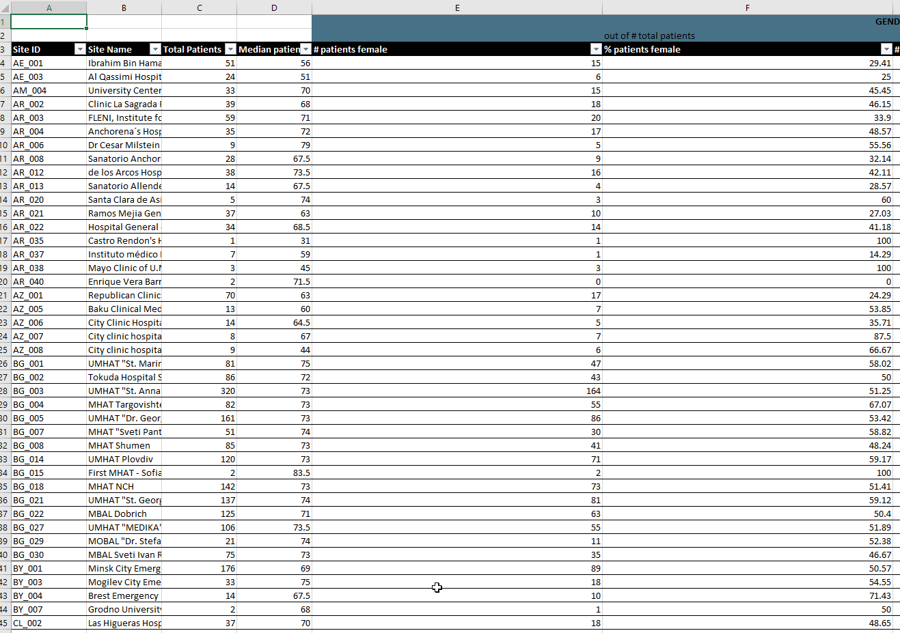

.Example of the formatted statistics for CZ
[#quarter_CZ_Q1_2020]
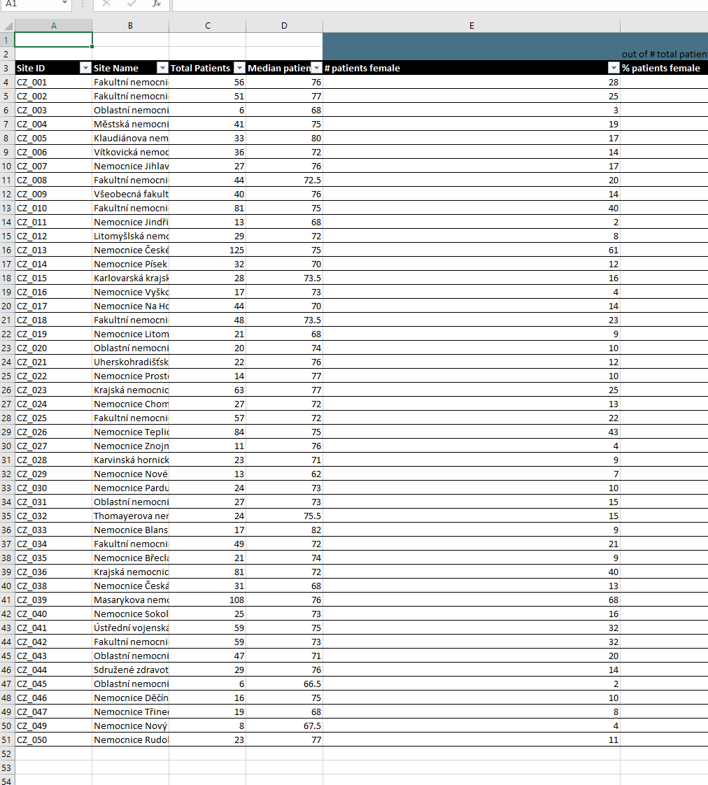

.Example of the formatted statistics for CZ site
[#quarter_CZ_008_Q1_2020]
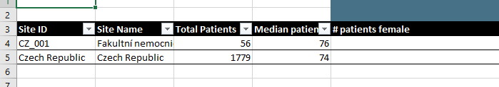

=== CheckData.py
The following example will generate the preprocessed data from the raw dataframe downloaded from the datamix database. 

==== Check and preprocess data
[source,python]
----
from resqdb.CheckData import CheckData # <1>

chd_obj = CheckData(df=df, nprocess=nprocess) # <2>
preprocessed_data = chd_obj.preprocessed_data # <3>
----
<1> Import `CheckData` from the `resqdb` package. 
<2> Create new `CheckData` object. 
<3> Get property `preprocessed_data` from the CheckData object.

=== GeneratePresentation.py
The following example will generate the presentation with the graphs based on the arguments. You can generate presentation for country or for site. 

[source,python]
----
from resqdb.GeneratePresentation import GeneratePresentation # <1>

GeneratePresentation(df=stats_df, report='quarter', quarter='Q1_2020') # <2>
GeneratePresentation(df=stats_df, report='quarter', quarter='Q1_2020', country_code='CZ', country_name='Czech Republic') # <3>
GeneratePresentation(df=stats_df, report='quarter', quarter='Q1_2020', country_code='CZ', country_name='Czech Republic') # <4>
----
<1> Import `GeneratePresentation` module from the `resqdb` package. 
<2> Generate the graphs. If you provide the statistics with all the sites the graphs will be huge therefore I recommend for this graph, the comparison stats between countries. 
<3> This will generate graphs for country. Each bar is one site. You have to provide calculations for country that is mentioned in the name. These reports are generated for a national coordinators. 
<4> This code will generate graphs for site. Therea are two bars in the graph. One is for site and one is for country. These reports are genrated for a local coordinators. 

.Example of the site report
[#site_presentation]
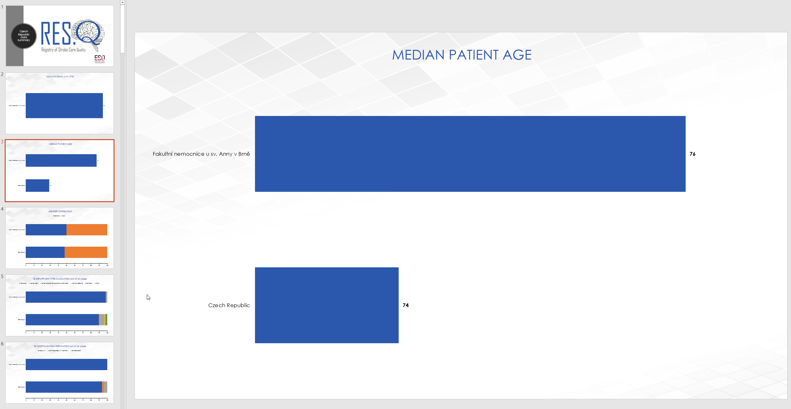

=== GeneratePeriodCompPresentation.py
The following examples can be used to generate the comparison graphs. 

==== National vs site-level samples
The following example of the code is the code for the generation of the comparison report, national samples vs. site-level samples. The example of the graph you can see below (<<national_vs_site>>).

[source,python]
----
from resqdb.GenerateComparisonPresentation import GenerateCountriesCompPresentation # <1>
from resqdb.Connection import Connection
from resqdb.Calculation import ComputeStats # <2>

c = Connection(nprocess=3)
raw_df = c.preprocessed_data

raw_df['COUNTRY_CODE'] = raw_df.apply(lambda x: x['Protocol ID'].split('_')[0], axis=1) # <3>

nationally_samples = ['TH', 'VN', 'CZ', 'PL', 'BG', 'UA', 'CO', 'RS', 'PT', 'LV', 'RO', 'HR', 'HU', 'MD', 'KG', 'LT'] # <4>

ndf = raw_df.loc[raw_df['COUNTRY_CODE'].isin(nationally_samples)].copy() # <5>
stats_ndf_obj = ComputeStats(df=ndf, comparison=True)
stats_ndf = stats_ndf_obj._return_stats()

site_samples = ['RU', 'IN', 'PH', 'AR', 'ID', 'KR', 'MY', 'MX', 'CL', 'IR', 'GR', 'BY', 'EG', 'TR', 'UZ', 'IT', 'GE', 'SA', 'DZ', 'KZ', 'AE', 'AZ', 'EE'] # <6>

sldf = raw_df.loc[raw_df['COUNTRY_CODE'].isin(site_samples)].reset_index(drop=True) # <7>
stats_sldf_obj = ComputeStats(df=sldf, comparison=True)
stats_sldf = stats_sldf_obj._return_stats()

GenerateCountriesCompPresentation(ndf=stats_ndf, sldf=stats_sldf, name='Q1_2020', samples=nationally_samples) # <8>
----
<1> Import `GenerateCountriesCompPresentation` package from `resqdb` package. 
<2> Import `ComputeStats` package from `resqdb` package. 
<3> Create a new column with the country codes to make filtration faster. 
<4> Define the nationally samples. 
<5> Filter the preprocessed data for the nationally samples and calculate statistics. Set `comparison` to True in the `ComputeStats` because you need comparison between countries not sites.
<6> Define the site samples. 
<7> Filter the preprocessed data for the site samples and calculate statistics. 
<8> Generate presentation with the graphs for nationally vs site-level samples. Arguments: `ndf` - the calculated statistic for nationally samples, `sldf` - the calculated statistic for site-level samples, `name` - the name of quarter or the result presentation and `sampels` - the list of nationally samples -> in the presentation these samples will be marked with different color. 

.Example of the national vs site-level samples comparison
[#national_vs_site]
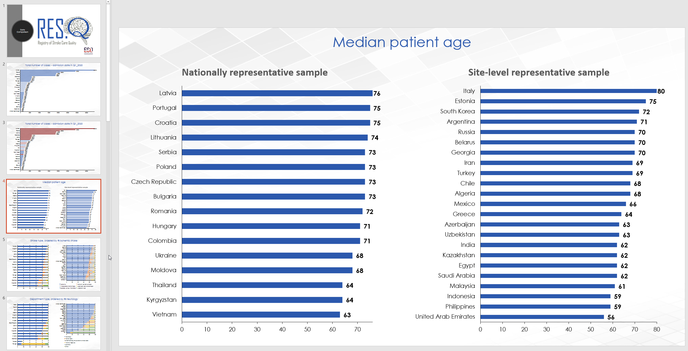

==== National yearly comparison
The following example of the code is the code for the generation of the comparison report for the national sites (only two years comparison). The example of the graph you can see below (<<national_yearly>>).

[source,python]
----
from resqdb.GenerateComparisonPresentation import GeneratePeriodCompPresentation # <1>
from resqdb.Connection import Connection
from resqdb.Calculation import ComputeStats, FilterDataset 
from datetime import date 

c = Connection(nprocess=3)
raw_df = c.preprocessed_data

raw_df['COUNTRY_CODE'] = raw_df.apply(lambda x: x['Protocol ID'].split('_')[0], axis=1) # <2>

nationally_samples = ['TH', 'VN', 'CZ', 'PL', 'BG', 'UA', 'CO', 'RS', 'PT', 'LV', 'RO', 'HR', 'HU', 'MD', 'KG', 'LT'] # <3>

ndf = raw_df.loc[raw_df['COUNTRY_CODE'].isin(nationally_samples)].copy() # <4>

date11 = date(2019, 1, 1) 
date12 = date(2019, 12, 31) 
fndf1 = FilterDataset(df=ndf, date1=date11, date2=date12) # <5>
ndf1 = fndf1.fdf

stats_ndf1_obj = ComputeStats(df=ndf1, comparison=True) # <6>
stats_ndf1 = stats_ndf1_obj._return_stats()

date21 = date(2020, 1, 1)
date22 = date(2020, 12, 31)
fndf2 = FilterDataset(df=ndf, date1=date21, date2=date22) # <7>
ndf2 = fndf2.fdf

stats_ndf2_obj = ComputeStats(df=ndf2, comparison=True) # <8>
stats_ndf2 = stats_ndf2_obj._return_stats()

GeneratePeriodCompPresentation(ndf1=stats_ndf1, ndf2=stats_ndf2, name1='2019', name2='2020') # <9>
----
<1> Import `GeneratePeriodCompPresentation` package from `resqdb` package. 
<2> Create a new column with the country codes to make filtration faster. 
<3> Define the nationally samples. 
<4> Filter the national dataframe for the nationally samples.
<5> Define dates (eg. 2019) and filter national dataframe. 
<6> Calculate statistics for the filtered dataframe. 
<7> Define dates for another period (eg. 2020) and filter national dataframe.
<8> Calculate statistics for the filtered dataframe. 
<9> Generate presentation with the graphs for the yearly comparison of national samples. Arguments: `ndf1` - the calculated statistic for the first period, `ndf2` - the calculated statistic for the second period, `name1` - the name of the first period (eg. 2019) and `name2` - the name of the second period (eg. 2020).

.The example of the national comparison between two years
[#national_yearly]
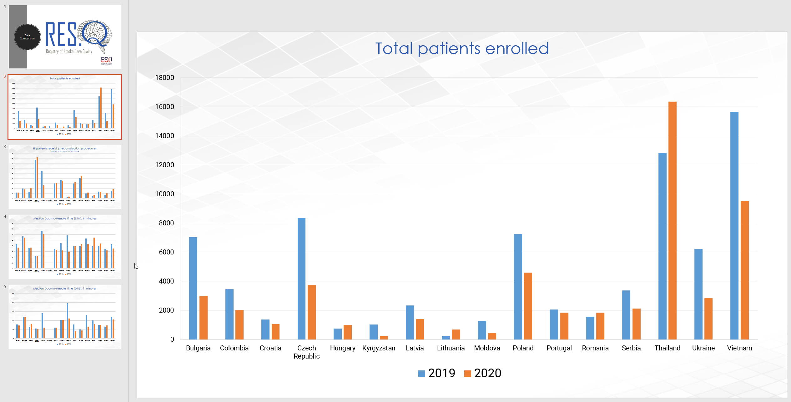

=== GenerateNationalComparisonGraphs.py
The example of the national comparison graphs where the data for the last period are included as a general report (<<national_comparison>>). Let's generate comparison graphs per years for Q1 and include outcome and include the Q1 general presentation as well. 

[source,python]
----
from resqdb.GenerateNationalComparisonGraphs import GenerateNationalComparisonGraphs # <1>
from resqdb.Connection import Connection
from resqdb.Calculation import FilterDataset, ComputeStats
from resqdb.functions import calculate_outcome
from datetime import date
import pandas as pd

c = Connection(nprocess=3)
raw_df = c.preprocessed_data

years = [2017, 2018, 2019, 2020] # <2>
report_type = 'quarter' # <3>
period = 'Q1'

dataframes = {}
for i in years: # <4>
    date1 = date(i, 1, 1)
    date2 = date(i, 3, 31)

    fob = FilterDataset(df=raw_df, country='CZ', date1=date1, date2=date2) # <5>
    fdf = fob.fdf

    if i == years[-1]: # <6>

        outcome_df = calculate_outcome(fdf) # <7>
        comp_df = ComputeStats(df=fdf, country=True, country_code='CZ', period=period, raw_data=raw_df) # <8>
        last_df = comp_df._return_stats()
    
    dataframes[i] = fdf # <9>

df = pd.DataFrame() # <10>
for i in range(0, len(years)):
    df = df.append(dataframes[years[i]], sort=False)

df['Protocol ID'] = df.apply(lambda x: x['DISCHARGE_DATE'].year, axis=1) # <11>
df['Site Name'] = df['Protocol ID']
df['ESO Angels name'] = df['Protocol ID']

comp_df = ComputeStats(
    df=df, 
    comparison=False, 
    country_code='CZ', 
    period=period, 
    raw_data=raw_df
    ) # <12>
stats_df = comp_df._return_stats()

report_name = f'CZ_Q1_comparison'

GenerateNationalComparisonGraphs(
    df=last_df, 
    fdf=stats_df, 
    outcome=outcome_df, 
    country=True, 
    country_code='CZ',
    report=report_name,
    quarter=period) # <13>
----
<1> Import `GenerateNationalComparisonGraphs` from `resqdb` package. 
<2> Define years to be compared. 
<3> Set the period name to `quarter` and the quarter name to `Q1` because we are intrested in the results for Q1 in the example.
<4> Iterate over years and filter raw data per years and add them into dictionary. 
<5> Filter dataframe for country and dates. 
<6> If year is equal to the last year in the list of years, calculate also outcome resuls and statistics per site. 
<7> Calculate outcome results. 
<8> Calculate statisitcs per sites for country, eg. CZ. 
<9> Append filtered dataframe into dictionary of dataframes 
<10> Create empty dataframe and append all the filtered dataframes and create one final dataframe. 
<11> Replace Protocol ID (the main column used in grouping) by year, also the Site Name and ESO Angels Name. 
<12> Calculated statistics for all the years. 
<13> Generate presentation with graphs for all the years where the last quarter is included as a general country report. 

.The example of the national comparison reports
[#national_comparison]
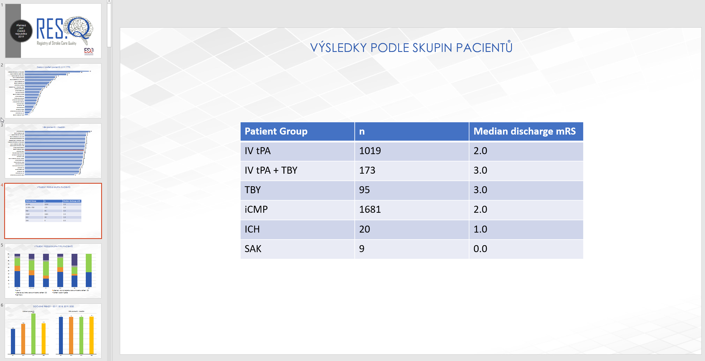

=== Reports.py
This class has been created for the Czech Republic and generates reports for recanalized patients. Two reports are generated, monthly report (<<monthly>>) and cumulative reports (<<cumulative>>). Month-ly report creates one presentation included results for one month and cumulative reports creates one presentation including results from January to month from the monthly report of that year. 

[source,python]
----
from resqdb.Connection import Connection
from datetime import datetime
from resqdb.Reports import GeneratePresentation # <1>

c = Connection(nprocess=3)
raw_df = c.preprocessed_data # <2>

year = 2020 # <3>
month = 5 # <4>
country='CZ' # <5>

month_name = datetime(year, month, 1, 0, 0).strftime('%b') # <6>

reports = GeneratePresentation(df=raw_df, year=year, month=month, country=country) # <7>
reports.generate_presentation() # <8>
----
<1> Import `GeneratePresentation` from `resqdb` package. 
<2> Get `preprocessed_data` from the `Connection` class. 
<3> Set year for which the statistics should be generated. 
<4> Set month for which the statistics should be generated (eg. 5 = May)
<5> Set country code for which the statistics should be generated (now only CZ available).
<6> Get month name from the set month. 
<7> Create `GeneratePresentation` object. Arguments: `df` - the preprocessed data, `year` - the year, `month` - the month and `country` - the country code. 
<8> Generate presenation. 

.The example of the monthly report
[#monthly]
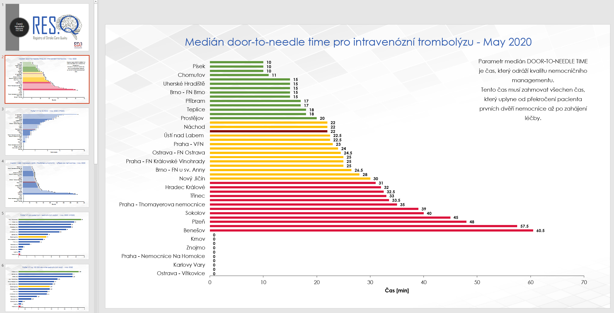

.The example of the cumulative report
[#cumulative]
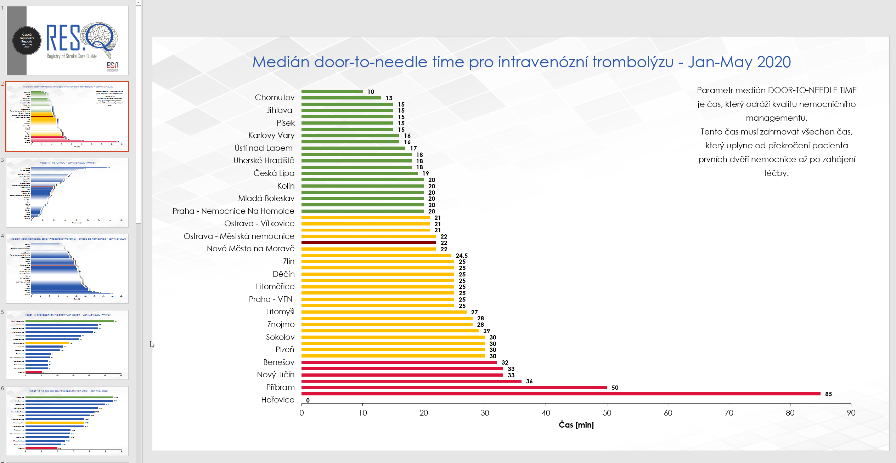

=== Qasc.py
This class has been created to generate Qasc reports. As a result, two presentations are produced, one with the pre phase report (<<pre_phase>>) and second includes comparison with post phase (<<pre_post_phase>>). 

[source,python]
----
from resqdb.Qasc import Qasc # <1>

qasc = Qasc() # <2> 
preprocessed_data = qasc.preprocessed_data.copy() # <3>

qasc.generate_reports(site_id='AM_001') # <4>
----
<1> Import `Qasc` class from the `resqdb` package. 
<2> Create new Qasc object. 
<3> Get preprocessed data. You don't need them directly, but it is always good to save them into csv file. 
<4> Generate reports QASC reports for the AM_001 site. 

.The example of the pre report
[#pre_phase]
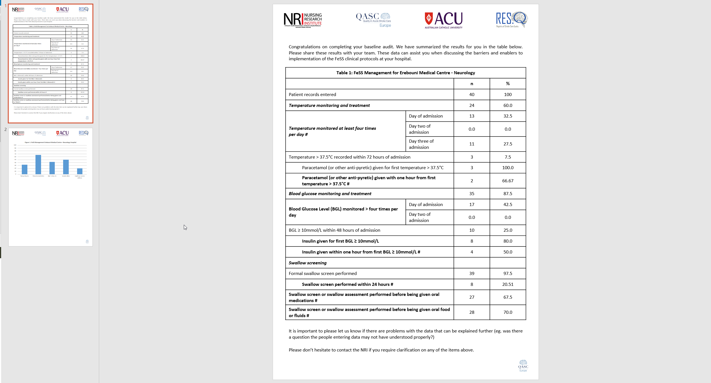

.The example of the pre/post comparison report
[#pre_post_phase]
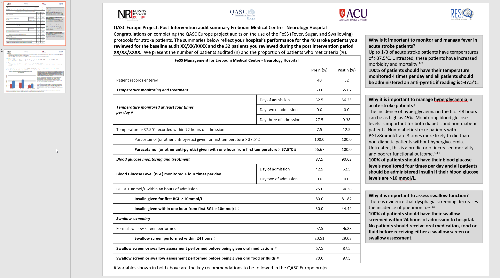

=== AfricaReport.py
This class has been creatd to generate reports for the South Africa. As a results, reports similar to general reports are generated. The only change is, that South Africa requested just a few variables to be calculated. 

There are three types of reports to be generated for South Africa. 

* **COUNTRY REPORT** (<<ch_country_report>>) -> this reports contains overall results for the South Africa and results per sites. 
* **REGION REPORT** (<<ch_region_report>>) -> this report contains overall results for the South Africa and results per countries. 
* **SITE REPORT** (<<ch_site_report>>) -> this report contains overall results for South Africa, overall results for region and results for site. 

[NOTE]
====
You can generate all of these type of reports in one run. 
====

[#ch_country_report]
==== Country report
The following code is example of the code used to generate country report. 

[source,python]
----
from resqdb.AfricaReport import AfricaReport # <1>
from datetime import date

df = pd.read_csv('preprocessed_data.csv', sep=',', encoding='utf-8', low_memory=False) # <2>
report_type = 'quarter' # <3>
period_name = 'Q1_2020'
start_date = date(2020, 1, 1)
end_date = date(2020, 3, 31)

report = AfricaReport(
    df=df,
    start_date=start_date,
    end_date=end_date,
    report_type=report_type,
    period_name=period_name
) # <4>

report = AfricaReport(
    start_date=start_date,
    end_date=end_date,
    report_type=report_type,
    period_name=period_name
) # <5>
----
<1> Import `AfricaReport` from `resqdb` package. 
<2> If you want to generate statistics from already saved preprocessed data (use africa preprocessed data, data for South Africa are not included in `resq` table). 
<3> Define report type, period name, start date and end date. Data will be filtered for start and end date. 
<4> Generate report for South Africa from the preprocessed data. Arguments: `df` - the preprocessed data, `start_date` - the start date for filtration, `end_date` - the end date for filtration, `report_type` - the report type name and `period_name` - the name of the period. 
<5> Generate report for South Africa from the database. Arguments: `start_date` - the start date for filtration, `end_date` - the end date for filtration, `report_type` - the report type name and `period_name` - the name of the period. 

.The example of the country report for the South Africa
[#country_report]
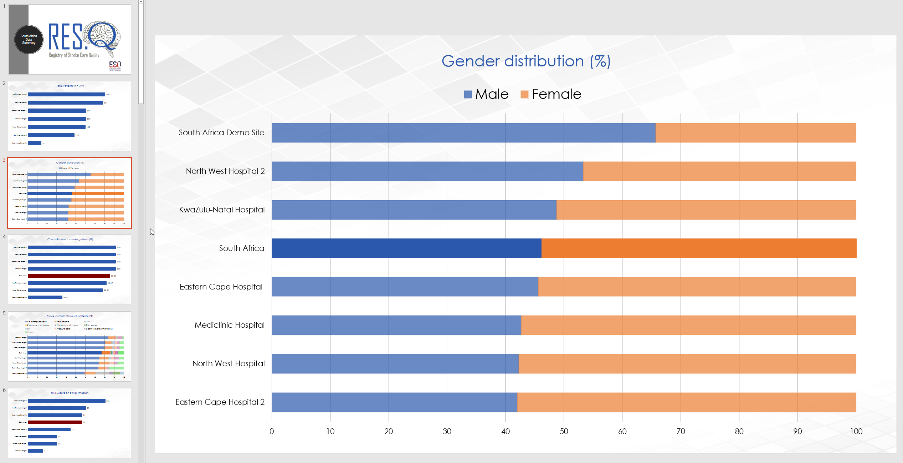

[#ch_region_report]
==== Region report
The following code is example of the code used to generate region reports. 

[source,python]
----
from resqdb.AfricaReport import AfricaReport # <1>
from datetime import date

df = pd.read_csv('preprocessed_data.csv', sep=',', encoding='utf-8', low_memory=False) # <2>
report_type = 'quarter' # <3>
period_name = 'Q1_2020'
start_date = date(2020, 1, 1)
end_date = date(2020, 3, 31)

report = AfricaReport(
    df=df,
    start_date=start_date,
    end_date=end_date,
    report_type=report_type,
    period_name=period_name,
    region_reports=True
) # <4>

report = AfricaReport(
    start_date=start_date,
    end_date=end_date,
    report_type=report_type,
    period_name=period_name,
    region_reports=True
) # <5>
----
<1> Import `AfricaReport` from `resqdb` package. 
<2> If you want to generate statistics from already saved preprocessed data (use africa preprocessed data, data for South Africa are not included in `resq` table). 
<3> Define report type, period name, start date and end date. Data will be filtered for start and end date. 
<4> Generate report for South Africa from the preprocessed data. Arguments: `df` - the preprocessed data, `start_date` - the start date for filtration, `end_date` - the end date for filtration, `report_type` - the report type name, `period_name` - the name of the period and `region_reports` - True if region reports should be generated. 
<5> Generate report for South Africa from the database. Arguments: `start_date` - the start date for filtration, `end_date` - the end date for filtration, `period_name` - the name of the period and `region_reports` - True if region reports should be generated.

.The example of the region report for the South Africa
[#region_reports]
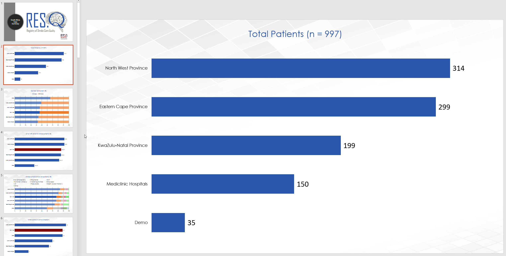

[#ch_site_report]
==== Site report
The following code is example of the code used to generate site report. 

[source,python]
----
from resqdb.AfricaReport import AfricaReport # <1>
from datetime import date

df = pd.read_csv('preprocessed_data.csv', sep=',', encoding='utf-8', low_memory=False) # <2>
report_type = 'quarter' # <3>
period_name = 'Q1_2020'
start_date = date(2020, 1, 1)
end_date = date(2020, 3, 31)

report = AfricaReport(
    df=df,
    start_date=start_date,
    end_date=end_date,
    report_type=report_type,
    period_name=period_name,
    site_reports=True
) # <4>

report = AfricaReport(
    start_date=start_date,
    end_date=end_date,
    report_type=report_type,
    period_name=period_name,
    site_reports=True
) # <5>
----
<1> Import `AfricaReport` from `resqdb` package. 
<2> If you want to generate statistics from already saved preprocessed data (use africa preprocessed data, data for South Africa are not included in `resq` table). 
<3> Define report type, period name, start date and end date. Data will be filtered for start and end date. 
<4> Generate report for South Africa from the preprocessed data. Arguments: `df` - the preprocessed data, `start_date` - the start date for filtration, `end_date` - the end date for filtration, `report_type` - the report type name, `period_name` - the name of the period and `site_reports` - True if site reports should be generated. 
<5> Generate report for South Africa from the database. Arguments: `start_date` - the start date for filtration, `end_date` - the end date for filtration, `period_name` - the name of the period and `site_reports` - True if site reports should be generated.

.The example of the site report for the South Africa
[#site_reports]
image::./assets/img/2020-09-14-12-18-11.png[]

== Additional files
In the folder `tmp` you can find all additional files necassary to run some packages. 

* **colors.json** -> this file contains colors used in the `FormatData.py` class. 
* **czech_mapping.json** -> in this file you can find the names for the Czech Republic hospitals. They have different names for the monthly reports but also for Angels Awards results. 
* **legends.csv** -> in this file you can modify the legend added into preprocessed data, such as add variables, change mapping etc. 
* **regions.json** -> in this file you can find the region distribution for the Czech Republic. These data are used in the monthly reports. In this file is mentioned population and the hospital which belongs to which region. You can add/modify the data here. 
* **sk_mapping.csv** -> Slovakia asked us to modify the hospital names before data are uploaded to the AA portal. In this file you can find the name mapping (how it is in the datamix and how it should be in the result calculation).
* **south_africa_mapping.json** -> this file includes mapping of the region code with region name for South Africa.
